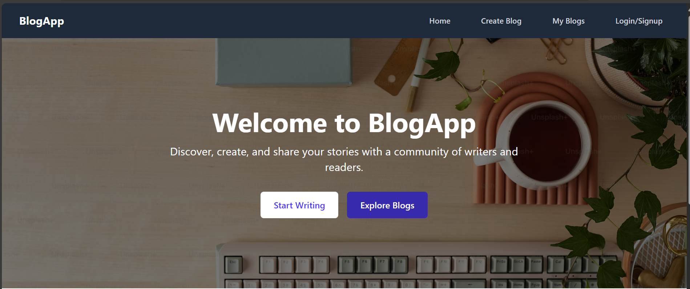

# Personal Blog Platform

[](https://myblogapp-git-main-lees-projects-c8f36431.vercel.app/)

### [](https://myblogapp-git-main-lees-projects-c8f36431.vercel.app/)

A full-stack MERN (MongoDB, Express.js, React, Node.js) application designed as a personal blogging platform. Users can create, edit, and delete their own blogs, while anyone can read blogs and authenticated users can comment. The project leverages DevOps practices including version control, CI/CD pipelines, cloud hosting, and monitoring for reliable deployment and maintenance.

## Features

- **User Authentication**: Register and login with JWT-based authentication.
- **Blog CRUD**:
  - Create, edit, and delete blogs (restricted to the blog’s owner).
  - Read blogs publicly without authentication.
- **Comments**: Authenticated users can comment on any blog, with usernames pulled from their JWT token.
- **Blog List**: Displays a card-based preview of blogs with truncated content (first 100 characters).
- **My Blogs Page**: A dedicated page for users to manage their own blogs with edit/delete options.
- **Responsive Design**: Basic styling for usability across devices.
- **Security**: HTTPS, environment variables for sensitive data, and access control for blog management.

## Tech Stack

- **Frontend**: React, React Router, Axios, jwt-decode,react-quill
- **Backend**: Node.js, Express.js, MongoDB (Mongoose), JWT, bcryptjs,morgan
- **DevOps Tools**:
  - Version Control: Git & GitHub
  - CI/CD: GitHub Actions
  - Hosting: Render (backend), Vercel (frontend)
  - Logging/Monitoring: Morgan (backend), Render dashboard
- **Database**: MongoDB Atlas

## Prerequisites

- Node.js (v18 or later)
- npm (v6 or later)
- MongoDB Atlas account (or local MongoDB instance)
- GitHub account
- Render and Vercel accounts for deployment

## Setup Instructions

### 1. Clone the Repository

```bash
git clone https://github.com/PLP-Full-Stack-Development-MERN/week-7-deployment-and-devops-essentials-SaddamTechie.git mern-blog
cd mern-blog-platform
```

2. Backend Setup
   Navigate to the backend:

```bash
   cd backend
```

Install dependencies:

```bash
   npm install
```

Create a .env file:

```
   MONGO_URI=your_mongodb_connection_string
   PORT=5000
   JWT_SECRET=your_secret_key
```

Start the backend locally:

```bash
   npm start
```

3. Frontend Setup
   Navigate to the frontend:

```bash
   cd ../frontend
```

Install dependencies:

```bash
   npm install
```

Start the frontend locally:

```bash
   npm start
```

Opens at http://localhost:5173.

4. Testing Locally
   - Register/login at /auth.
   - Create blogs at /create.
   - View all blogs at / (with truncated previews).
   - Manage your blogs at /my-blogs.
   - Read and comment on blogs at /blog/:id.

### Security Considerations

- HTTPS enforced by Render and Vercel.
- Sensitive data (e.g., MONGO_URI, JWT_SECRET) stored in environment variables.
- Authentication required for creating, editing, deleting blogs, and commenting.
- Access control ensures only blog owners can edit/delete their posts.

### Usage

- Public Users: Browse blogs at / and read full posts at /blog/:id.
- Authenticated Users:
- Login/register at /auth.
- Create blogs at /create.
- Manage blogs (edit/delete) at /my-blogs.
- Comment on any blog at /blog/:id.

### Future Improvements

- Implement pagination for the blog list.
- Add user profiles and avatars.
